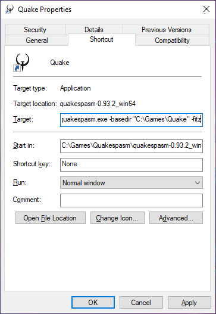
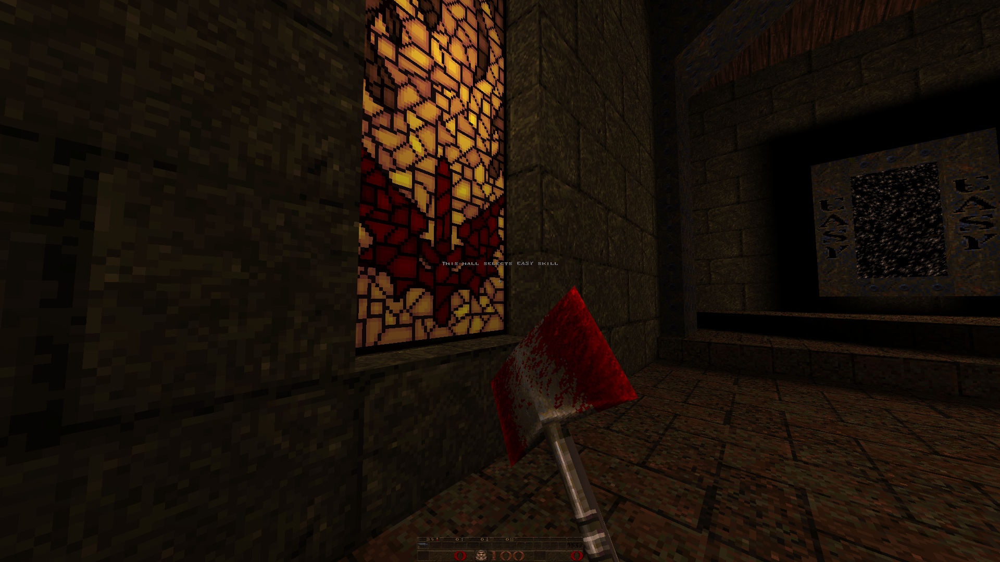
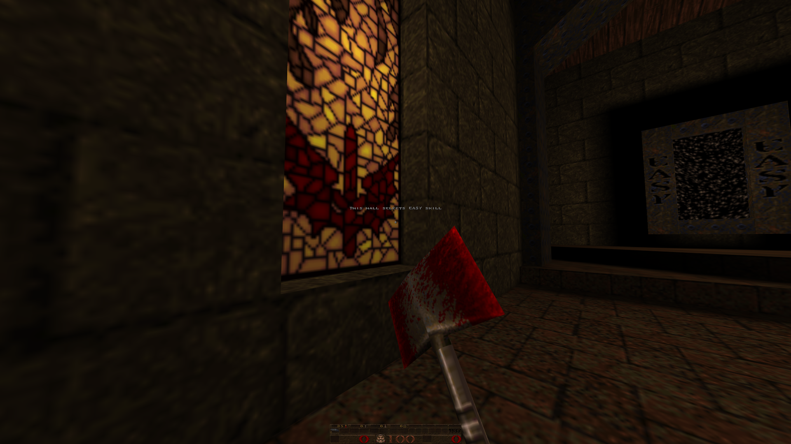

# Quakespasm configuration

## TL;DR

1. Install your game from GOG/Steam/original CD.
2. Download Quakespasm from http://quakespasm.sourceforge.net/download.htm.
3. Extract Quakespasm archive into a convenient location (mine is in `C:\Games\Quakespasm`).
4. Create a shortcut to `quakespasm.exe` on your desktop.
5. Right click the shortcut, open properties, and on the `Shortcut` tab add the following after `quakespasm.exe`:
* Quake (base game with no expansions): `-basedir "C:\Games\Quake" -fitz`.
* Scourge of Armagon: `-basedir "C:\Games\Quake" -fitz -hipnotic`.
* Dissolution of Eternity: `-basedir "C:\Games\Quake" -fitz -rogue`.
* Dimension of the Past (DOPA): `-basedir "C:\Games\Quake" -fitz -game dopa`.

Replace "C:\Games\Quake" with the path to the folder where you have Quake installed. Your `Target` field for the shortcut should look something like this:



The full text does fit into the window on the screenshot, full value should look something like this:

```C:\Games\Quakespasm\quakespasm-0.93.2_win64\quakespasm.exe -basedir "C:\Games\Quake" -fitz```

6. Go to `id1` subfolder in your Quake directory, and add the following lines to your `autoexec.cfg` (create that file if it doesn't exist):

```
+mlook
alias +movejump "+jump;+moveup;"
alias -movejump "-jump;-moveup;"
alias pixel_off "echo Pixels off; gl_texturemode GL_LINEAR_MIPMAP_LINEAR; bind o pixel_on"
alias pixel_on "echo Pixels on; gl_texturemode GL_NEAREST; bind o pixel_off"
bind "SPACE" "+jump"
bind "a" "+moveleft"
bind "c" "+movedown"
bind "d" "+moveright"
bind "s" "+back"
bind "w" "+forward"
bind "CTRL" "+movedown"
bind "MOUSE1" "+attack"
bind "MOUSE2" "+movejump"
bind "mwheeldown" "impulse 12"
bind "mwheelup" "impulse 10"
bind o pixel_on
crosshair 1
fov "105"
sv_aim 0
```

You can also add `host_maxfps` to with whatever refresh rate you display supports, for my 144 Hz monitor I use this:

`host_maxfps "144"`

Then in the same folder in `config.cfg` find and replace the following lines (or add them if don't have them):

```
vid_fsaa "8"
vid_fullscreen "1"
vid_height "1080"
vid_width "1920"
```

Replace `vid_height` and `vid_width` with your screen resolution values if necessary.

This will give you normal modern FPS controls with mouselook and crosshair. You can also toggle between pixelated and filtered textures by pressing "O" (the letter, not the zero digit) on your keyboard.




## Command line

NOTE: You can run Quakespasm from any directory, but it will create a `history.txt` file in that directory, which will contain the history of the console commands you entered while playing, if any.

- Quake: `quakespasm -basedir <quake directory> -fitz`.
- Scourge of Armagon: `quakespasm -basedir <quake directory> -fitz -hipnotic`.
- Dissolution of Eternity: `quakespasm -basedir <quake directory> -fitz -rogue`.
- Dimension of the Past: `quakespasm -basedir <quake directory> -fitz -game dopa`.

Use `-basedir` to specify where the directory with Quake data files is.
Use `-fitz` to play demos in main menu (like vanilla Quake).

## Dimension of the Past

Dimension of the Past (DOPA) is an "unofficial official" Episode 5 developed by MachineGames and released for free as a gift for the fans for Quake's 20th anniversary.

https://cdn.bethsoft.com/quake/dopa.rar

## Saves location

Savegames go into the `id1` directory in your Quake installation folder, eg. `C:\Games\Quake\id1`, or into the respective mission pack subdirectory (`C:\Games\Quake\hipnotic` or `C:\Games\Quake\rogue`)

## Controls settings

- Enable mouselook: `+mlook`.
- Enable crosshair: `crosshair 1`.
- Disable vertical auto-aim: `sv_aim 1`.

Faster rising underwater on RMB (add to your config):

    alias +movejump "+jump;+moveup;"
    alias -movejump "-jump;-moveup;"
    bind mouse2 +movejump

Source: https://www.quaddicted.com/quake/configuration

Switch weapons with mouse wheel:

    bind "mwheelup" "impulse 10"
    bind "mwheeldown" "impulse 12"

### Scourge of Armagon

Bind keys for new weapons:

    bind 9 "impulse 225"
    bind 0 "impulse 226"

Source: https://www.reddit.com/r/quake/comments/7y1msq/quake_scourge_of_armagon_new_gun_key_bindings/

## Graphics settings

- Disable texture filtering (causes blurry textures): `gl_texturemode GL_NEAREST_MIPMAP_NEAREST` or `GL_NEAREST`.
- Enable square particles (like vanilla Quake): `r_particles 2`.
- Disable animation interpolation (makes animations look choppy like in vanilla Quake): `r_lerpmodels 0` and `r_lerpmove 0`.
- Enable FSAA: `vid_fsaa 8`.

`gl_texturemode` values:
- `GL_NEAREST`: Point sampled (software-like). Lowest quality, highest performance.
- `GL_NEAREST_MIPMAP_NEAREST`: GL_NEAREST but with a bit more quality for far objects.
- `GL_NEAREST_MIPMAP_LINEAR`: GL_NEAREST but with even more quality for far objects.
- `GL_LINEAR`: No blending.
- `GL_LINEAR_MIPMAP_NEAREST`: Bilinear interpolation.
- `GL_LINEAR_MIPMAP_LINEAR`: Trilinear interpolation. Highest quality, lowest performance.

Source: https://www.quaddicted.com/webarchive/www.quaddicted.com/software-vs-glquake/software-vs-glquake-texture-filtering/

Bind filtering mode toggle to a key (add to your config):

    alias pixel_on "gl_texturemode GL_NEAREST; bind o pixel_off"
    alias pixel_off "gl_texturemode GL_LINEAR_MIPMAP_LINEAR; bind o pixel_on"
    bind o pixel_on

Source: https://www.quaddicted.com/webarchive/www.quaddicted.com/software-vs-glquake/software-vs-glquake-texture-filtering/

## Playing demos

Put the demo files into `id1` (or respective directory with `pak0.pak`), then
run Quakespasm the same way as when playing the game, but add
`+playdemo <demo name>` at the end. You can omit `-fitz` because it does nothing
when running with `+playdemo`.
For example, to play a demo of Scourge of Armagon, run this:

`quakespasm -basedir <quake directory> -hipnotic +playdemo <demo name>`

### dzip

There seems to be no dz support in Quakespasm, so you'll have to extract it using dzip before playing.

#### Downloads

Main page: http://speeddemosarchive.com/dzip/download.html
Alternate linux instructions: https://linuxg.net/install-dzip-on-ubuntu/
